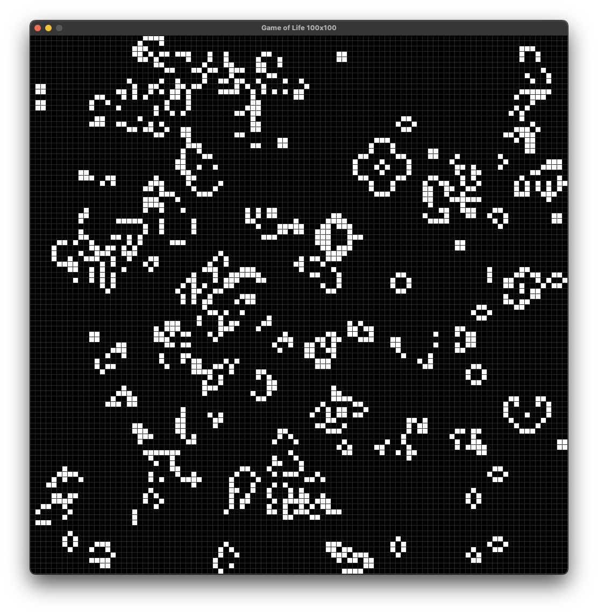

# Conway's Game of Life

An implementation of Conway's Game of Life using Python and Pygame


## Requirements

- Python 3.12

## Install

1. Clone the Repository
2. Create and activate a Virtual Environment

```shell
  python -m venv venv
  # on Linux or MacOS
  source venv/bin/activate
  # on Windows
  venv/Scripts/activate
```

3. Install the requirements

```shell
pip install -r requirements.txt
```

4. Optionally change Game of Life settings in main.py

5. Start the Game of Life

```shell
python main.py
```
